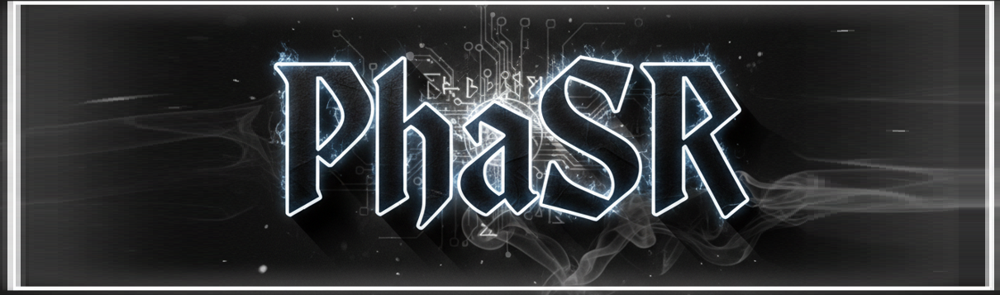
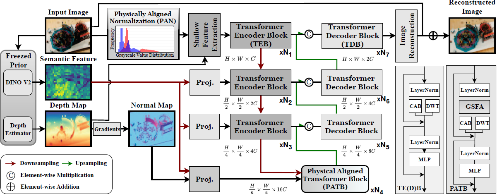

<div align="center">

# PhaSR: Generalized Image Shadow Removal with Physically Aligned Priors



## [[Paper Link]](https://arxiv.org/abs/2601.17470) [[Project Page]](https://ming053l.github.io/PhaSR_github/) [[Model zoo]](https://drive.google.com/drive/folders/XXXXX) [[Visual Results]](https://drive.google.com/drive/folders/XXXXX)

[Chia-Ming Lee](https://ming053l.github.io/), [Yu-Fan Lin](https://vanlinlin.github.io/), Yu-Jou Hsiao, Jing-Hui Jung, [Yu-Lun Liu](https://www.cmlab.csie.ntu.edu.tw/~yulunliu/), [Chih-Chung Hsu](https://cchsu.info/)

National Yang Ming Chiao Tung University, National Cheng Kung University

</div>

## Overview

**TL;DR:** PhaSR combines parameter-free Retinex normalization with geometric-semantic cross-modal attention for state-of-the-art shadow removal and ambient lighting normalization with the highest efficiency.

- **Background and Motivation**

Shadow removal under diverse lighting conditions requires disentangling illumination from intrinsic reflectance. Existing methods struggle with: (1) confusing shadows with intrinsic material properties, (2) limited generalization from single-light to multi-source ambient lighting, and (3) loss of physical priors through encoder-decoder bottlenecks.

- **Main Contribution**

PhaSR addresses these challenges through **dual-level physically aligned prior integration**:

1. **PAN (Physically Aligned Normalization)** - Parameter-free preprocessing via Gray-world normalization, log-domain Retinex decomposition, and dynamic range recombination, consistently improving existing architectures by 0.15-0.34 dB.

2. **GSRA (Geometric-Semantic Rectification Attention)** - Cross-modal differential attention (`A_rect = A_sem - λ·A_geo`) harmonizing DepthAnything-v2 geometry with DINO-v2 semantics.



**Benchmark results on shadow removal and ambient lighting normalization.**

| Model | Params | FLOPs | ISTD+ | WSRD+ | Ambient6K |
|:-----:|:------:|:-----:|:-----:|:-----:|:---------:|
| OmniSR | 24.55M | 78.32G | 33.34 | 26.07 | 23.01 |
| DenseSR | 24.70M | 81.13G | 33.98 | 26.28 | 22.54 |
| **PhaSR** | **18.95M** | **55.63G** | **34.48** | **28.44** | **23.32** |

## Updates

- ✅ 2025-11-16: Project page released.
- ⏳ Pretrained models coming soon.

### Installation
```bash
git clone https://github.com/ming053l/phasr.git
conda create --name phasr python=3.9 -y
conda activate phasr
pip install torch==2.0.1 torchvision==0.15.2 torchaudio==2.0.2 --index-url https://download.pytorch.org/whl/cu118
cd phasr
pip install -r requirements.txt
```

## Dataset Structure
[ISTD](https://drive.google.com/file/d/1I0qw-65KBA6np8vIZzO6oeiOvcDBttAY/view), [ISTD+](https://drive.google.com/file/d/1rsCSWrotVnKFUqu9A_Nw9Uf-bJq_ryOv/view?usp=sharing), [WSRD+](https://github.com/fvasluianu97/WSRD-DNSR), [SRD](https://github.com/jinyeying/DC-ShadowNet-Hard-and-Soft-Shadow-Removal), [Ambient6k](https://github.com/fvasluianu97/IFBlend)


```bash
dataset/
├── train
      ├── origin <- Shadow-affected images
      ├── shadow_free <- Shadow-free images
├── valid
      ├── origin <- Shadow-affected images
      ├── shadow_free <- Shadow-free images
├── test
      ├── origin <- Shadow-affected images
```

1. Clone [Depth anything v2](https://github.com/DepthAnything/Depth-Anything-V2.git)

```bash
git clone https://github.com/DepthAnything/Depth-Anything-V2.git
```
2. Download the [pretrain model of depth anything v2](https://huggingface.co/depth-anything/Depth-Anything-V2-Large/resolve/main/depth_anything_v2_vitl.pth?download=true)

3. Run ```calculate_depth_normal.py``` to create the depth and normal map
* You need to change the ```--root``` and ```--ckpt-path``` to your dataset and Depth Anything v2 ckpt path.
  * e.g. ```python calculate_depth_normal.py --root dataset/train(absolute path) --ckpt-path path_to_depth_anything_v2_ckpt```

```
dataset/
├── train
      ├── origin <- Shadow-affected images
      ├── depth <- .npy depth maps
      ├── shadow_free <- Shadow-free images
      ├── normal <- .npy normal maps
├── valid
      ├── origin <- Shadow-affected images
      ├── depth <- .npy depth maps
      ├── shadow_free <- Shadow-free images
      ├── normal <- .npy normal maps
├── test
      ├── origin <- Shadow-affected images
      ├── depth <- .npy depth maps
      ├── normal <- .npy normal maps
```

5. Clone [DINOv2](https://github.com/facebookresearch/dinov2.git)
```bash
git clone https://github.com/facebookresearch/dinov2.git
```

## How To Test
⚠️ You MUST change the path setting in ```test.py```
```bash
bash test.sh
```

## How To Train
⚠️ You MUST change the path setting in ```options.py```
```bash
bash train.sh
```

## Citations

If our work is helpful to your research, please kindly cite:
```bibtex
@misc{lee2024phasr,
      title={PhaSR: Generalized Image Shadow Removal with Physically Aligned Priors}, 
      author={Lee, Chia-Ming and Lin, Yu-Fan and Hsiao, Yu-Jou and Jung, Jing-Hui and Liu, Yu-Lun and Hsu, Chih-Chung},
      year={2026},
      eprint={2601.17470},
      archivePrefix={arXiv},
      primaryClass={cs.CV},
      url={https://arxiv.org/abs/2601.17470}, 
}
```

## Acknowledgments

Our work builds upon [OmniSR](https://github.com/xxx/omnisr), [DenseSR](https://github.com/xxx/densesr), [DepthAnything-v2](https://github.com/xxx/depth-anything-v2), and [DINO-v2](https://github.com/facebookresearch/dinov2). We are grateful for their outstanding contributions.

## Contact
If you have any questions, please email Chia-Ming Lee(zuw408421476@gmail.com), Yu-Fan Lin(aas12as12as12tw@gmail.com) to discuss with the authors.
